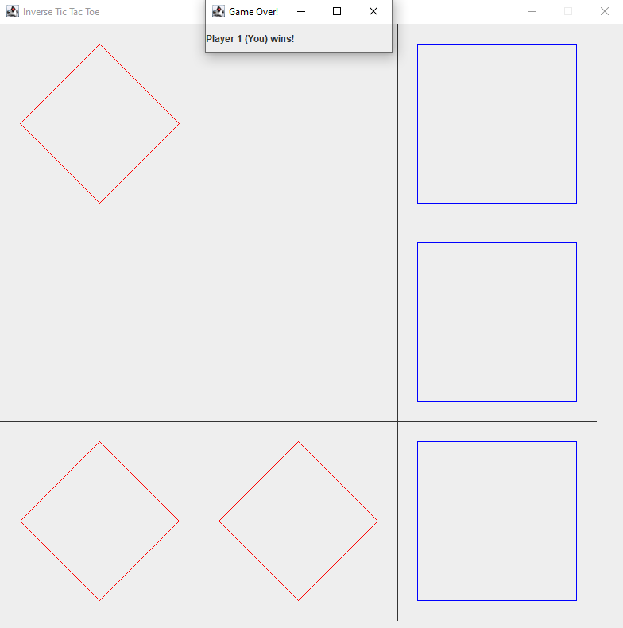

This project was developed during ICS 111 utilizing Java and its libraries. For this particular project, we created a Graphical User Interface (GUI) to create a functional game with simple visuals.

Inverse Tic-Tac-Toe seems the way it sounds -- it is Tic-Tac-Toe, but the opposite. Essentially, the player who gets 3 in a row on the board loses. If neither player gets 3 in a row, then the game is a draw.

This project uses the [Java Swing](https://docs.oracle.com/javase/7/docs/api/javax/swing/package-summary.html) library and [Java Abstract Window Toolkit](https://docs.oracle.com/javase/7/docs/api/java/awt/package-summary.html)
 to create the window for the application to run in. Upon the start of the application, a window resembling a regular game board for Tic-Tac-Toe is created. The user selects a pane to place their piece (the Red Diamond) and the application instantly generates a Blue Square indicating the opponent has moved. 

Although this project seems quite simple on paper, it was one of the more difficult projects to understand as graphics also played a part in the programming process. Admittedly, there are still a few kinks that occur while running the application such as the game board not properly displaying, but this project successfully shown me that there are many layers to which programming can work.
