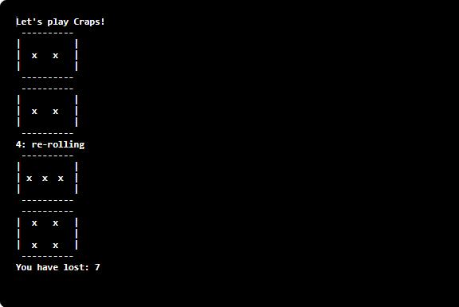

This project was my introduction to programming and its applications. The idea of the project was to apply the knowledge of Java I had been taught into an implementation of the game Craps. 

Briefly, Craps is a game where the player rolls a pair of dice. On the initial roll, if the player rolls either a 7 or 11, the player wins. If a 2, 3, or 12 is rolled, then the player loses. However, if the player rolls a number other than the ones mentioned, the player must roll the same number to win. Additionally, if they roll a 7, the player loses. The game continues until the player wins or loses.

The application runs and instantly prints out the results of the Craps. From another perspective, you are "rolling" by pressing the effective "run code" button. The program calls a function that randomly generates a number between 1 and 6, which then calls another function to print the respective die face. The program then adds the two function calls together in order to check with the win-lose conditions. 

This project had shown me just how powerful programming could be, along with its broad applications. Although this project may have been just a small implementation of the Java coding language, it was one of the significant starting points in my Computer Science career.
