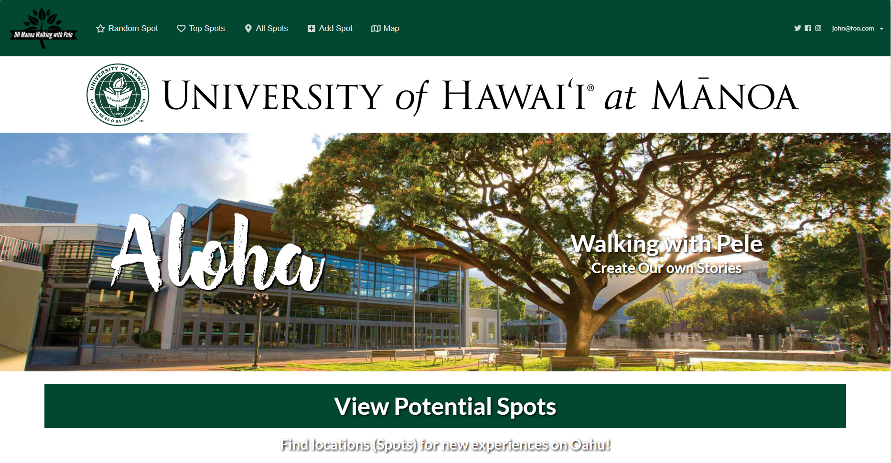
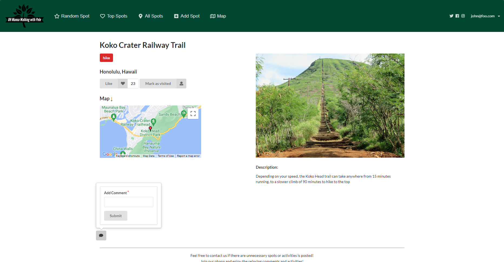
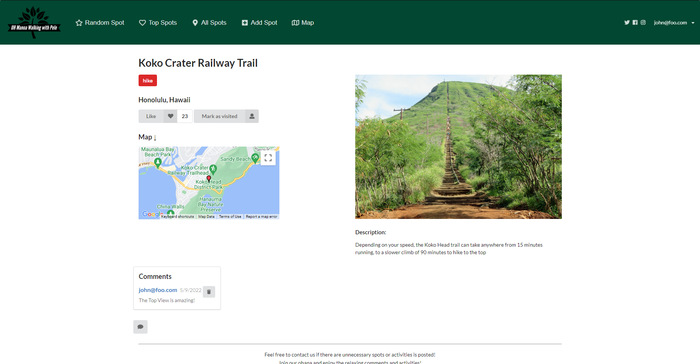

[Walking with Pele](https://walking-with-pele.github.io) is a web application that served as the final project for Software Engineering (ICS 314). It was designed and created by my group consisting of me, Kai He, Zhixin Li, Hyuma Tsuchiya, and Don Maddock. The mission for Walking with Pele was to provide University of Hawaii students with a way to find new experiences and locations while also connecting with other students. This project utilized everything we had learned in Software Engineering throughout the Spring 2022 semester. 

For this project, my group used [GitHub](https://github.com/walking-with-pele) to store the source code of this web application, along with managing it with Project Boards. My main contributions to this project were managing the project, providing design aspects, acceptance testing, and the project home board. As the main manager of the project, I ensured that as a group, we adhered to the Issue Driven Project Management system provided to us, along with merging branches in an organized fashion. Throughout the duration of this project, I provided support to my group through helping them on certain issues pertaining to the code. As milestones and deadlines arrived, I updated the Project Home Page accordingly and provided the acceptance testing required.

Another notable contribution I had made to this web application is the implementation of Comments. With previous knowledge, I had implemented a "Comments" section for each "Spot" page where it would display a user's comment. I also implemented a way for users to delete their own comment on any page.

Personally, I had found this project to be quite the learning experience. This project not only showed me the importance of collaboration, but also the importance of communication. Although more people working on the same problem is theoretically easier, it is still difficult without consistent and concise communication. Issue Driven Project Management had helped a lot with communication amongst ourselves as it served as the way marker for the direction of our project. There were certainly many ideas that we had hoped to implement such as a "Live Chat" between two users that did not occur on Spot pages and an information window that would open when you clicked on a marker on the map. This web application has promise to it, and I would love to work on it again in the future.

If you would like to go to the running application, please click [here](https://walking-with-pele.xyz/).
